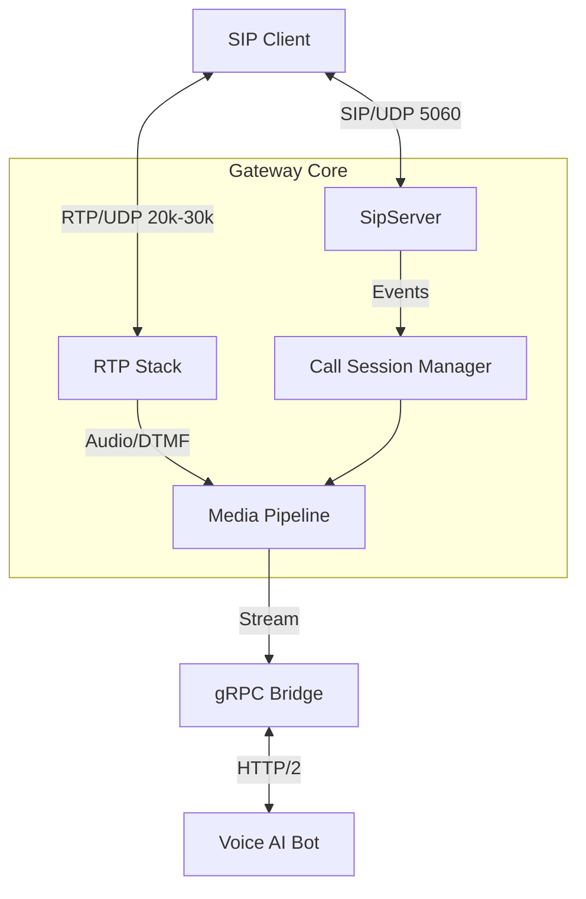

# System Architecture

The SIP Gateway is designed as a high-performance, modular bridge between legacy SIP infrastructure and modern gRPC-based voice AI bots.

## High-Level Diagram

## Core Components

### 1. SIP Stack (`src/sip`)
*   **Role**: Handles signaling (INVITE, BYE, ACK, etc.).
*   **Design**: Async UDP socket loop. Stateless packet parsing with stateful transaction/dialog tracking overlaid.
*   **Concurrency**: Single-threaded event loop for low overhead (scalable to thousands of calls with `epoll` in future).

### 2. RTP Stack (`src/rtp`)
*   **Role**: Handles media transport.
*   **Design**: 
    *   Dynamic port allocation from a configured range.
    *   **Symmetric RTP**: Locks onto the first incoming packet's source IP/Port to traverse NAT.
    *   **Jitter Buffer**: Minimal reordering buffer to handle network jitter.
    *   **DTMF**: RFC 4733/2833 in-band DTMF detection.

### 3. Media Pipeline (`src/media`)
*   **Pattern**: Chain-of-Responsibility.
*   **Stages**:
    *   `GrpcBridgeStage`: Sends/Receives audio to/from the gRPC bot.
    *   `EchoStage`: loops back audio for testing.
    *   `RecorderStage`: Dumps raw audio to disk for debugging/compliance.

### 4. gRPC Linking (`src/grpc`)
*   **Role**: Bidirectional streaming to the Voice Bot.
*   **Protocol**: Custom `voicebot.proto`.
*   **Optimizations**: Reuses channel, dedicated reader thread per call to prevent blocking the main SIP/RTP loop.

### 5. Call Management (`src/call`)
*   **CallSession**: The central aggregate root for a single call. Coordinates SIP dialog, RTP ports, and Media pipeline.
*   **CallRegistry**: Thread-safe map of active calls.
