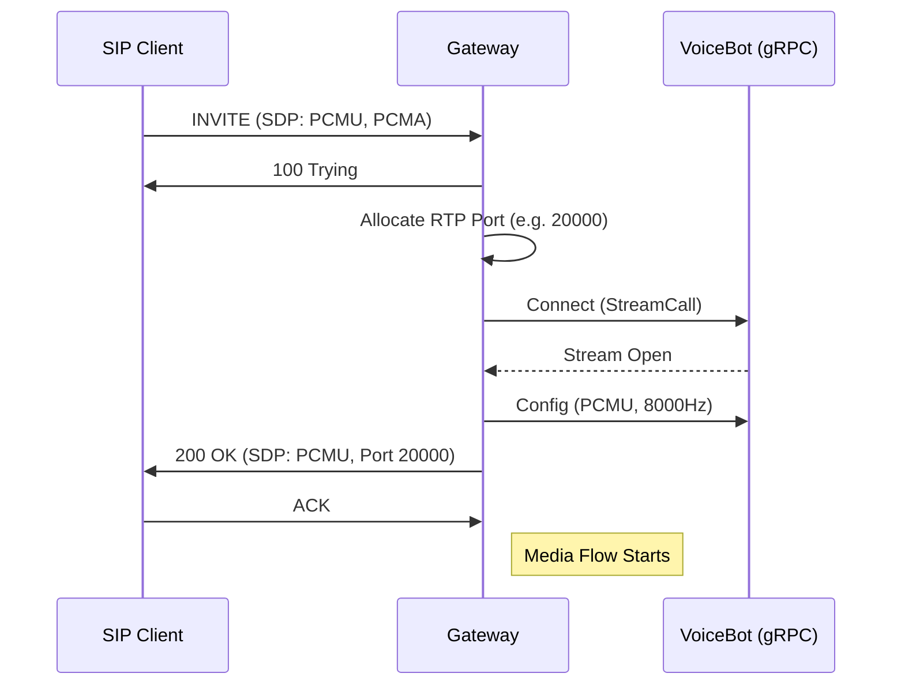
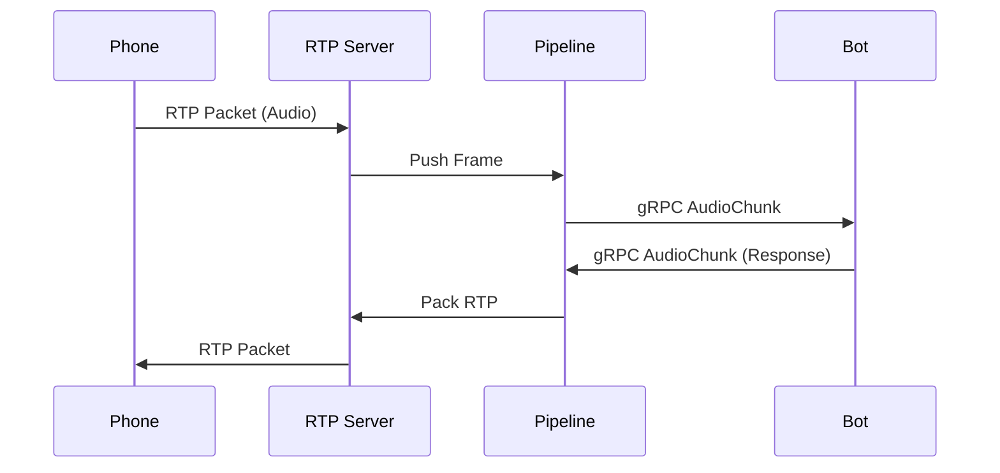
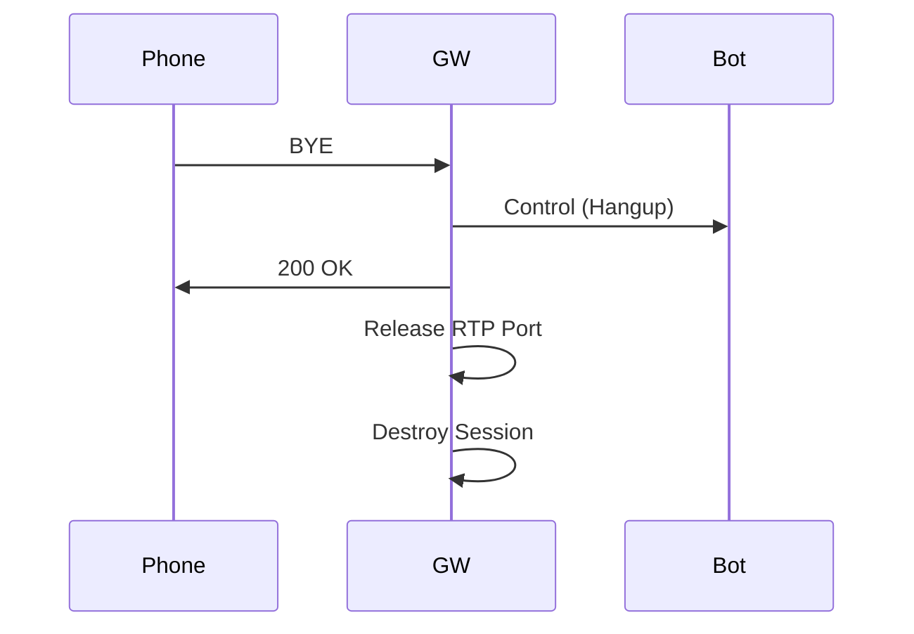

# System Flows

## 1. Inbound Call Setup

```mermaid
sequenceDiagram
    participant Phone as SIP Client
    participant GW as Gateway
    participant Bot as VoiceBot (gRPC)

    Phone->>GW: INVITE (SDP: PCMU, PCMA)
    GW->>Phone: 100 Trying
    GW->>GW: Allocate RTP Port (e.g. 20000)
    GW->>Bot: Connect (StreamCall)
    Bot-->>GW: Stream Open
    GW->>Bot: Config (PCMU, 8000Hz)
    GW->>Phone: 200 OK (SDP: PCMU, Port 20000)
    Phone->>GW: ACK
    
    note right of GW: Media Flow Starts
```

## 2. Media Loop

```mermaid
sequenceDiagram
    participant Phone
    participant GW_RTP as RTP Server
    participant Pipeline
    participant Bot

    Phone->>GW_RTP: RTP Packet (Audio)
    GW_RTP->>Pipeline: Push Frame
    Pipeline->>Bot: gRPC AudioChunk
    
    Bot->>Pipeline: gRPC AudioChunk (Response)
    Pipeline->>GW_RTP: Pack RTP
    GW_RTP->>Phone: RTP Packet
```

## 3. Call Termination (by Caller)

```mermaid
sequenceDiagram
    participant Phone
    participant GW
    participant Bot

    Phone->>GW: BYE
    GW->>Bot: Control (Hangup)
    GW->>Phone: 200 OK
    GW->>GW: Release RTP Port
    GW->>GW: Destroy Session
```
